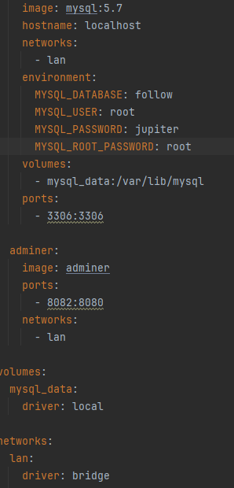
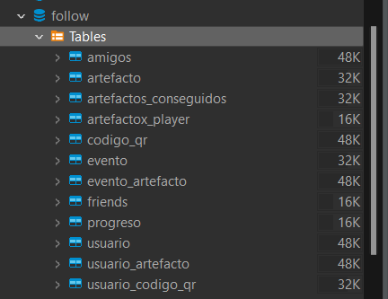
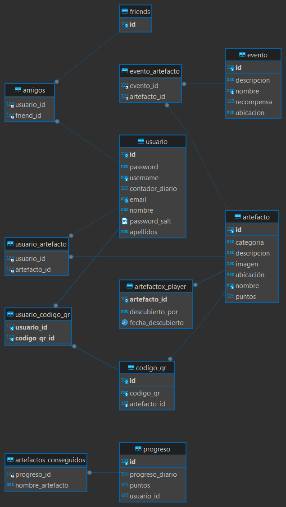

# Página de configuraciones

### Contenedor Docker
Nuestro contenedor docker ejecuta 2 servicios: "DB" para ejecutar y configurar MYSQL conectando con nuestra base de datos "follow", y "Adminer" para la administración web en localhost de esta misma BBDD.

---
### Base de Datos
El proyecto utiliza una base de datos relacional, MySQL, para almacenar y gestionar los datos. Los datos se organizan en tablas y se pueden relacionar entre sí.

En la imagen de abajo se muestran las tablas creadas en el proyecto aparte de las originales están las intermedias.

Se divide en las siguientes tablas:

- **Usuario**:

Tabla para almacenar a los usuarios en el sistema. Tiene campos para el nombre, apellidos, nombre de usuario, contraseña, correo electrónico, y otros. También tiene relaciones @ManyToMany con las entidades Friends, Artefacto y CodigoQR
- **Artefacto**:

Almacena los artefactos. Tiene campos para el nombre, imagen, descripción, categoría, ubicación, y puntos. Tiene una relación con la entidad @OneToMany en cuanto al CodigoQR y @ManyToMany con el Usuario.
- **CodigoQR**:

Almacena los codigos QR generados. Tiene campos para el id y el código QR. Tiene una relación @OneToOne con la entidad Artefacto y @ManyToMany con el Usuario.
- **Evento**:

Representa un evento especial que se añadirá en ocasiones especiales como Navidad, Pascuas... Tiene campos para el nombre, descripción, ubicación, y recompensa. Tiene una relación @ManyToMany con la entidad Artefacto.

---

**Diagrama Relacional (MySQL)**

En el diagrama se puede observar todas las relaciones que existen entre las tablas y las tablas intermedias generadas.

----

### Frameworks utilizados

- **Hibernate**

Es un framework de mapeo objeto-relacional (ORM) para Java. Permite mapear las clases a tablas de bases de datos y viceversa.

- **React Native Expo CLI** 

Es una herramienta que te ayuda a crear aplicaciones React Native. Proporciona un conjunto de herramientas y servicios que ayudan a gestionar y construir tu aplicación mediante CSS y liberias propias.
