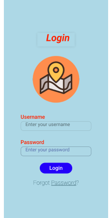
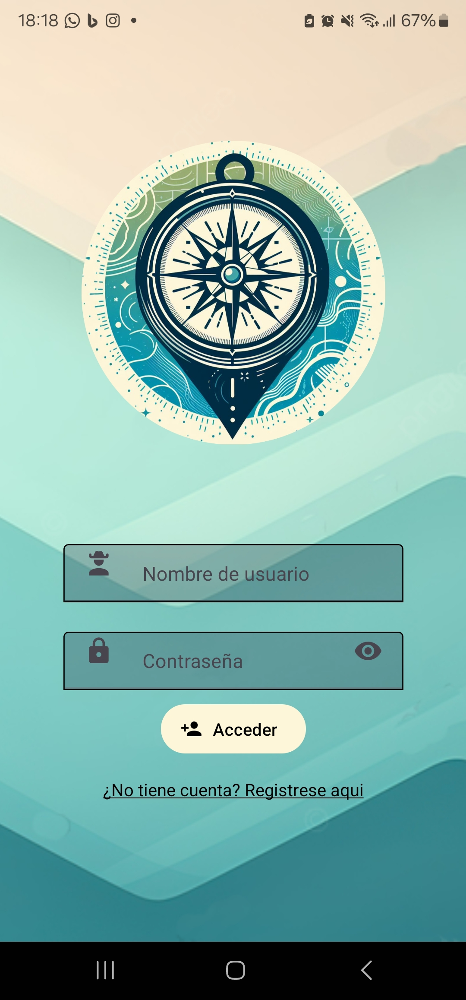
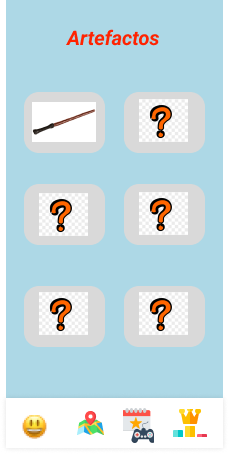
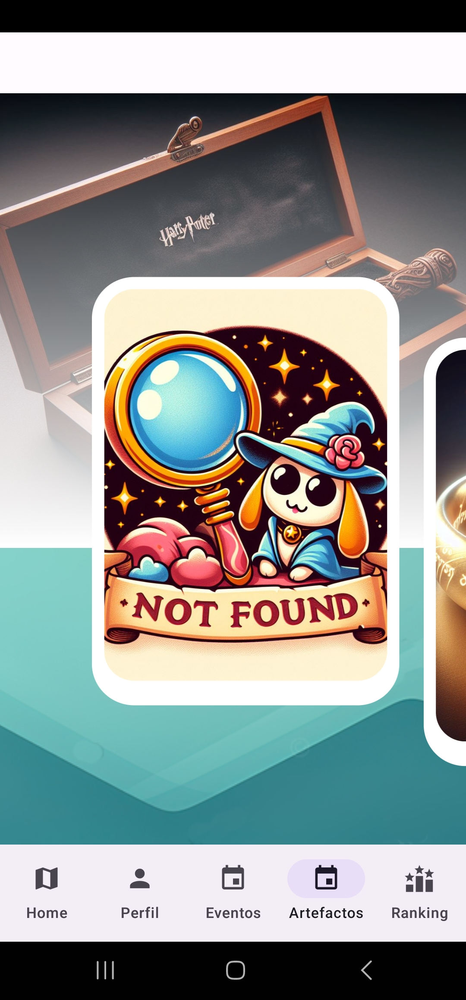
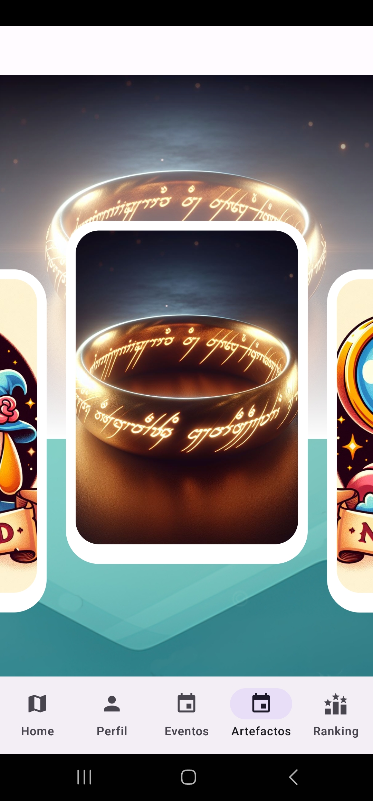
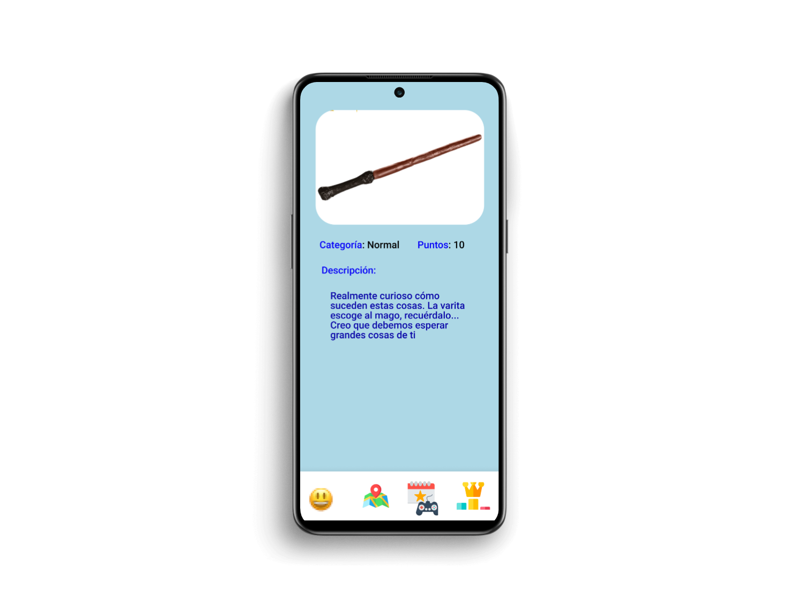
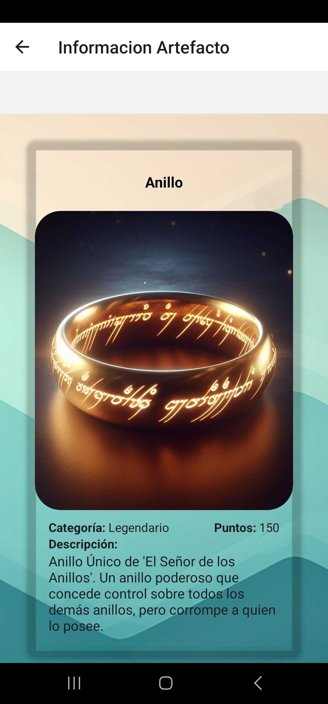

# Página de diseño

## Wireframe y Mockup

A lo largo del proceso de diseño, hemos tenido que tomar varias decisiones importantes. 
Una de las más significativas fue la decisión de alejarnos del diseño inicial de los wireframes. 
Aunque el diseño inicial era funcional, sentimos que le faltaba la chispa que hace que una aplicación sea 
realmente atractiva para los usuarios. Al final, decidimos optar por un diseño más vibrante y atractivo, 
y estamos muy contentos con los resultados.

Diseño original de nuestro wireframe:

Diseño final del mockup:

## Comparativa y toma de decisiones

Dado que nuestro diseño original no nos ha gustado lo suficiente hemos optado por modificar todo el diseño de todas las pantallas dado que nos parecía muy aburrido y poco original.

Hemos mantenido un poco los colores iniciales como el azul para el fondo aunque le hemos añadido un degradado en colores crema porque así lo hace más atractivo y la verdad que el diseño final ha quedado mucho mejor y atractiva.

**Pantallas**

Artefactos diseño inicial

Imagen pantalla de artefacto diseño inicial

Imagen pantalla de artefacto diseño final

Como se puede observar los diseños finales son mucho mejores, hemos integrado un carroussel para que se vean más divertido la recopilación de los artefactos, también hemos dejado como muestra el artefacto que estás buscando, pero si no lo has coseguido se muestra una imagen de NOT FOUND y tampoco se puede acceder a la información del artefacto hasta que no lo hayas obtenido, las imagenes que hemos integrado para cuando el usuario recoja los artefactos también son más animadas y de mejor calidad.
Consideramos que el diseño final se adapta mucho mejor a lo que nosotros esperábamos de esta aplicación

**Información del artefacto una vez escaneado**

Imagen información artefacto primer diseño

Imagen información artefacto diseño final

El diseño de la navegación del menu lo hemos mantenido como en un principio.

