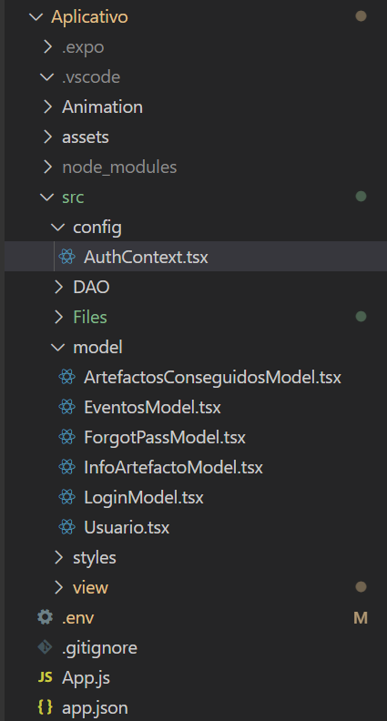

# Página de implementación

### Estructura del back-end

Hemos dividido el proyecto por carpetas para facilitar su localización. La estructura es la siguiente:

- **Java**:
    - **Dao**: Maneja la interacción con la base de datos de las diferentes clases creadas.
    - **Model**: Contiene las clases utilizadas en el proyecto.
    - **Service**: Encargado de toda la lógica del programa.
    - **Security**: Encargado de encriptar las contraseñas de los usuarios.
    - **API**: Contiene las clases controladoras para manejar las solicitudes HTTP.

En **Dao**, hemos creado clases separadas para manejar la interacción con la base de datos. Esto se ha hecho para mantener un enfoque ordenado y facilitar las modificaciones futuras.

En **Modelo**, se han creado clases con atributos, los getters, setters al utilizar Hibernate se autogenerarán mediante etiquetas, para las diferentes entidades del proyecto.

El **Service** maneja la lógica del proyecto, gestionando diferentes operaciones.

En **API**, se encuentran las clases controladoras que manejan las solicitudes HTTP entrantes y dirigen el flujo de ejecución adecuado a través del servicio correspondiente.

---

#### DAO

Clases para interactuar con la base de datos y manejar operaciones CRUD (crear, leer, actualizar y eliminar), extiende la interfaz de JpaRepository, por lo que hereda todos estos métodos CRUD básicos.

    - ArtefactoRepository 
    - CodigoQrRepository
    - EventosRepository
    - UsuarioRepository

El **Repository** es el encargado de interactuar con la base de datos sin tener que escribir consultas SQL explícitas, estos métodos se llaman en el código y Spring Data JPA se encargará de generar y ejecutar las consultas SQL correspondientes.

---

#### Modelo

- Clases que representan las entidades del sistema

    - **Usuario**: Modelo para usuarios con atributos como `nombre`, `correo electrónico`, `contraseña`, etc.
    - **Artefacto**: Modelo para el artefacto con atributos como `nombre`, `imagen`, `descripción`, etc.
    - **CodigoQR**: Modelo para lectura del QR con atributos como `id `, `código Qr`.
    - **Evento**: Modelo para eventos futuros tiene más o menos los atributos del artefacto, ya que, es una ampliación.

---
#### Service

Maneja la lógica del proyecto, gestionando diferentes operaciones

    - UsuarioService
    - ArtefactoService
    - CodigoQRService
    - EventoService

### Código más relevante

**Procesa la solicitud de inicio de sesión del usuario.**

      * @param usuarioRequest El objeto de solicitud que contiene el nombre de usuario y la contraseña.
      * @return ResponseEntity que contiene el usuario si el inicio de sesión fue exitoso, o un mensaje de error si la contraseña es incorrecta o el usuario no existe.

        public ResponseEntity postLogin(UsuarioRequest usuarioRequest) {

        // Obtener el nombre de usuario y la contraseña de la solicitud
        String username = usuarioRequest.getUsername();
        String password = usuarioRequest.getPassword();
    
        // Buscar el usuario en la base de datos por su nombre de usuario
        Optional<Usuario> existingUsuario = usuarioRepository.findByUsername(username);
        if (existingUsuario.isPresent()) {
        // Si el usuario existe, obtener sus detalles
        Usuario usuario = existingUsuario.get();

        // Obtener el salt de la contraseña almacenada y convertirlo a String
        String salt = new String(usuario.getPasswordSalt(), StandardCharsets.UTF_8);

        // Imprimir información de depuración
        System.out.println("Contraseña ingresada: " + password);
        System.out.println("Contraseña almacenada: " + usuario.getPassword());
        System.out.println("Salt: " + Base64.getEncoder().encodeToString(salt.getBytes()));

        // Validar la contraseña utilizando la función verificarPassword
        if (verificarPassword(password, usuario.getPassword(), salt)) {

        // Si la contraseña es correcta, devolver el usuario con un código 200 OK
        return ResponseEntity.ok().body(usuario);
        } else {
        // Si la contraseña es incorrecta, devolver un mensaje de error con un código 401 Unauthorized
        return ResponseEntity.status(HttpStatus.UNAUTHORIZED).body("{\"error\": \"Contraseña incorrecta\"}");
        }
        } else {
        // Si el usuario no existe, devolver un mensaje de error con un código 404 Not Found
        return ResponseEntity.status(HttpStatus.NOT_FOUND).body("{\"error\": \"Usuario no encontrado con el nombre de usuario: " + username + "\"}");
        }}

**Escanea un código QR y asigna el artefacto correspondiente al usuario.**
      
      * @param usuarioId El ID del usuario que escanea el código QR.
      * @param qrCode    El código QR escaneado por el usuario.
      * @return Un mensaje indicando si el usuario ya tiene el artefacto escaneado o si se ha obtenido con éxito.
      * @throws RuntimeException Si el usuario o el código QR no son encontrados en la base de datos.
        
        public String escanearCodigoQR(Integer usuarioId, String qrCode) {

        // Imprimir información de depuración sobre el código QR y el usuario
        System.out.println("Escanear Código QR: Usuario ID = " + usuarioId + ", Código QR = " + qrCode);
    
        // Buscar el usuario y el código QR en la base de datos
        Optional<Usuario> usuarioOptional = usuarioRepository.findById(usuarioId);
        Optional<CodigoQR> codigoQrOptional = codigoQrRepository.findByQrcode(qrCode);
    
        // Verificar si el usuario y el código QR fueron encontrados
        if (usuarioOptional.isPresent() && codigoQrOptional.isPresent()) {
        // Obtener el usuario y el artefacto asociado al código QR
        Usuario usuario = usuarioOptional.get();
        Artefacto artefacto = codigoQrOptional.get().getArtefacto();
    
             // Imprimir información de depuración
             System.out.println("Usuario y Código QR encontrados");
             System.out.println("if " + usuario.getArtefactosEscaneados().contains(artefacto));
    
             // Comprobar si el usuario ya tiene el artefacto escaneado
             if (usuario.getArtefactosEscaneados().contains(artefacto)) {
                 // Si el usuario ya tiene el artefacto, devolver un mensaje indicando que ya lo tiene
                 return "{\"message\": \"Ya tienes este artefacto.\"}";
             } else {
                 // Si el usuario no tiene el artefacto, asignarlo al usuario y guardar los cambios en la base de datos
                 System.out.println("else " + artefacto);
                 usuario.escanearArtefacto(artefacto);
                 usuarioRepository.save(usuario);
                 return "{\"message\": \"Artefacto obtenido con éxito.\"}";
             }
        } else {
        // Si el usuario o el código QR no son encontrados, lanzar una excepción
        throw new RuntimeException("Usuario o Código QR no encontrado");
        }}

**Crea un nuevo código QR y lo asigna a un artefacto existente.**

    * @param qrCode El código QR que se va a crear y asignar.
      * @return ResponseEntity con el estado HTTP correspondiente.

        public ResponseEntity postQrCode(CodigoQR qrCode) {
        // Buscar el artefacto por el nombre del código QR
        System.out.println("Buscando el código QR: " + qrCode.getQrcode());
        Optional<Artefacto> artefactoOptional = artefactoRepository.findByNombre(qrCode.getQrcode());
    
        // Comprobar si ya existe un CodigoQR con el mismo qrcode
        Optional<CodigoQR> codigoQrExistente = codigoQrRepository.findByQrcode(qrCode.getQrcode());
    
        // Si el CodigoQR ya existe, se devuelve un error de conflicto
        if (codigoQrExistente.isPresent()) {
        return ResponseEntity.status(HttpStatus.CONFLICT).body("El CodigoQR ya existe");

        } else if (artefactoOptional.isPresent()) {
        // Si el artefacto existe, se asigna al código QR y se guarda en la base de datos
        qrCode.setArtefacto(artefactoOptional.get());
        this.codigoQrRepository.save(qrCode);
        return ResponseEntity.status(HttpStatus.CREATED).build();

        } else {
        // Si el artefacto no existe, se devuelve un error de no encontrado
        return ResponseEntity.status(HttpStatus.NOT_FOUND).body("Artefacto no encontrado");
        }}

**Busca un artefacto asociado a un código QR dado.**

    * @param qrCode El código QR para el que se desea buscar el artefacto.
      * @return ResponseEntity con el estado HTTP correspondiente y el artefacto asociado, si se encuentra.

        public ResponseEntity getArtefactoPorCodigoQR(String qrCode) {
        System.out.println("Buscando el código QR: " + qrCode);
        Optional<CodigoQR> codigoQrOptional = codigoQrRepository.findByQrcode(qrCode);
    
        // Comprobar si el código QR existe en la base de datos
        if (codigoQrOptional.isPresent()) {
        CodigoQR codigoQR = codigoQrOptional.get();
        Artefacto artefacto = codigoQR.getArtefacto();
        System.out.println("Artefacto asociado al código QR encontrado: " + artefacto.getNombre());
        System.out.println("El usuario ha conseguido el artefacto: " + artefacto.getNombre());
        return ResponseEntity.ok().body(artefacto); // Devuelve el artefacto asociado al código QR
        } else {
        System.out.println("Código QR no encontrado");
        return ResponseEntity.status(HttpStatus.NOT_FOUND).build(); // Devuelve un error si el código QR no se encuentra
        }}

**Verifica si un usuario tiene un artefacto específico.**

    * @param usuarioId   El ID del usuario.
      * @param artefactoId El ID del artefacto.
      * @return true si el usuario tiene el artefacto, false en caso contrario.
      
        public boolean usuarioTieneArtefacto(Integer usuarioId, Integer artefactoId) {
        return usuarioRepository.usuarioTieneArtefacto(usuarioId, artefactoId);
        }

---
### Security:

Apartado encargado de encriptar la contraseña del usuario en el momento de registrarse y de hacer la comprobación cuando hace un inicio de sesión.

---
#### (API REST) Explicación de todos los endpoints:

Contiene las clases controladoras para manejar las solicitudes HTTP

    - UsuarioControlle
    - ArtefactoController
    - CodigoQRController
    - EventoController

**UsuarioControlle**

La URL base para todos los endpoints es /usuarios. Cada endpoint tiene una funcionalidad específica, como se describe a continuación.

- GET /usuarios: Retorna una lista de todos los usuarios.
- GET /usuarios/usuario/{username}: Retorna el usuario con el nombre de usuario especificado.
- GET /usuarios/{id}: Retorna el usuario con el ID especificado.
- POST /usuarios: Crea un nuevo usuario con los detalles proporcionados en el cuerpo de la solicitud.
- POST /usuarios/login: Auténtica a un usuario con las credenciales proporcionadas en el cuerpo de la solicitud.
- POST /usuarios/all: Crea varios usuarios con los detalles proporcionados en el cuerpo de la solicitud.
- PUT /usuarios/{username}: Actualiza el usuario con el nombre de usuario especificado con los detalles proporcionados en el cuerpo de la solicitud.
- DELETE /usuarios/{username}: Elimina el usuario con el nombre de usuario especificado.

Los ***endpoints*** POST /usuarios, POST /usuarios/login, POST /usuarios/all, y PUT /usuarios/{username} esperan un cuerpo de solicitud con los detalles del usuario. Los endpoints GET /usuarios/usuario/{username}, GET /usuarios/{id}, PUT /usuarios/{username}, y DELETE /usuarios/{username} esperan un parámetro de ruta con el nombre de usuario o el ID del usuario.

La ***respuesta*** varía dependiendo del endpoint. Por ejemplo, GET /usuarios devuelve una lista de usuarios, mientras que POST /usuarios/login devuelve los detalles del usuario autenticado. Si ocurre un error, se devuelve un mensaje de error junto con el código de estado HTTP apropiado.

**ArtefactoController**
La **URL** base para todos los endpoints es /artefactos. Cada endpoint tiene una funcionalidad específica, como se describe a continuación.

- GET /artefactos: Retorna una lista de todos los artefactos.
- POST /artefactos/all: Crea varios artefactos con los detalles proporcionados en el cuerpo de la solicitud.
- POST /artefactos: Crea un nuevo artefacto con los detalles proporcionados en el cuerpo de la solicitud.
- PUT /artefactos/{nombre}: Actualiza el artefacto con el nombre especificado con los detalles proporcionados en el cuerpo de la solicitud.
- DELETE /artefactos/{nombre}: Elimina el artefacto con el nombre especificado.

Los ***endpoints*** POST /artefactos/all, POST /artefactos, y PUT /artefactos/{nombre} esperan un cuerpo de solicitud con los detalles del artefacto. Los endpoints PUT /artefactos/{nombre} y DELETE /artefactos/{nombre} esperan un parámetro de ruta con el nombre del artefacto.

La ***respuesta*** varía dependiendo del endpoint. Por ejemplo, GET /artefactos devuelve una lista de artefactos, mientras que POST /artefactos devuelve un código de estado HTTP 201 para indicar que el artefacto fue creado con éxito. Si ocurre un error, se devuelve un mensaje de error junto con el código de estado HTTP apropiado.

**CodigoQRController**

La ***URL*** base para todos los endpoints es /codigoQr. Cada endpoint tiene una funcionalidad específica, como se describe a continuación.
- GET /codigoQr: Retorna una lista de todos los códigos QR.
- GET /codigoQr/{codigoQr}: Retorna el artefacto asociado al código QR especificado.
- POST /codigoQr: Crea un nuevo código QR con los detalles proporcionados en el cuerpo de la solicitud.
- POST /codigoQr/all: Crea varios códigos QR con los detalles proporcionados en el cuerpo de la solicitud.
- PUT /codigoQr/{qrcode}: Actualiza el código QR con el código especificado con los detalles proporcionados en el cuerpo de la solicitud.
- DELETE /codigoQr/{qrcode}: Elimina el código QR con el código especificado.

Los **endpoints** POST /codigoQr, POST /codigoQr/all, y PUT /codigoQr/{qrcode} esperan un cuerpo de solicitud con los detalles del código QR. Los endpoints GET /codigoQr/{codigoQr}, PUT /codigoQr/{qrcode} y DELETE /codigoQr/{qrcode} esperan un parámetro de ruta con el código del código QR.

La **respuesta** varía dependiendo del endpoint. Por ejemplo, GET /codigoQr devuelve una lista de códigos QR, mientras que POST /codigoQr devuelve un código de estado HTTP 201 para indicar que el código QR fue creado con éxito. Si ocurre un error, se devuelve un mensaje de error junto con el código de estado HTTP apropiado.

---
### Estructura del front-end

Hemos dividido el proyecto por carpetas para facilitar su localización. La estructura es la siguiente:

- **Aplicativo**:
    - **config**: Contiene el Auth que es el encargado de crear un contexto de autenticación en React utilizando el contexto API.
      
          export const AuthContext = createContext<{
              isLoggedIn: boolean;
              userId: string;
              userName: string;
              password: string;
              user: Usuario;
              setLoggedIn: (loggedIn: boolean) => void;
              setUserId: (userId: string) => void;
              setPassword: (password: string) => void;
              setUserName: (userName: string) => void;
              setUser: (user: Usuario) => void;
              }>({
              isLoggedIn: false,
              userId: '',
              userName: '',
              password: '',
              user: new Usuario,
              setUserId: () => {},
              setLoggedIn: () => {},
              setPassword: () => {}
              });
        
            export const AuthProvider = ({ children }: { children: ReactNode }) => {
            const [isLoggedIn, setIsLoggedIn] = useState(false);
            const [userId, setUserId] = useState('');
            const [userName, setUserName] = useState('');
            const [password, setPassword] = useState('');
            const [user, setUsu] = useState(new Usuario);
        
            const setLoggedIn = (loggedIn: boolean) => {
                setIsLoggedIn(loggedIn);
            }
        
            const setUser = (user: Usuario) => {
                setUsu(user);
            }
        
            return (
                <AuthContext.Provider value={{ isLoggedIn, userId, userName, password, user,
                    setLoggedIn, setUserId, setUserName, setPassword, setUser}}>
                    {children}
                </AuthContext.Provider>
            );
        }  

    - **DAO**: el encargado de hacer las comprobaciones con base de datos como por ejemplo auténtica un usuario utilizando el nombre de usuario y la contraseña proporcionados, dejo la muestra del código a continuación.
  
            * @param username El nombre de usuario del usuario.
            * @param password La contraseña del usuario.
            * @returns Los datos del usuario si la autenticación es exitosa, de lo contrario, arroja un error.
            * @throws Error Si ocurre un error durante la autenticación.
        
              export const authenticateUser = async (username: string, password: string): Promise<any> => {
              try {
              const response = await fetch(`${apiUrl}/usuarios/login`, {
              method: 'POST',
              headers: {
              'Content-Type': 'application/json',
              },
              body: JSON.stringify({ username, password }),
              });
    
                   if (response.ok) {
                       const userData = await response.json();
                       console.log('Datos del usuario:', userData);
                       return userData;
                   } else {
                       const errorMessage = await response.text();
                       console.error('Error al autentificar el usuario. Código de estado:', response.status, 'Mensaje:', errorMessage);
                       throw new Error('Error al autentificar el usuario: ' + errorMessage);
                   }
              } catch (error) {
              console.error('Error al realizar la solicitud:', error);
              console.log('Solicitud:', JSON.stringify({ username, password }));
              throw error;
              }};

  - **Files**: Hemos integrado en esta parte las imagenes que vamos a necesitar para que funcione correctamente.
    - **Model**: Clase con los datos que necesitamos.
    
          class Usuario {
          constructor(
          public id: string = "",
          public name: string = "",
          public surname: string = "",
          public email: string = "",
          public username: string = "",
          public password: string = "",
          public passwordSalt: string = "",
          ){}
          }
          export default Usuario;
    
    - **View**: Diseño de las pantallas que tendrá nuestro aplicativo con todas las funcionalidades para que funcione correctamete.

  [vidioAplicativo.mp4](vidioAplicativo.mp4)

      import React, { useContext, useEffect, useState } from "react";
      import { Image, ImageBackground, Text, TouchableOpacity, View } from "react-native";
      import CommonsStyle from "../styles/CommonsStyle";
      import Commons from "../styles/Commons";
      import { Button, TextInput } from "react-native-paper";
      import { AuthContext } from "../config/AuthContext";
      import Usuario from "../model/Usuario";
      import { SafeAreaProvider } from "react-native-safe-area-context";
      import { CheckUser } from "../DAO/CheckUser";
      import AsyncStorage from "@react-native-async-storage/async-storage";
        
    const Login = ({ navigation }) => {
    
    const { setLoggedIn, setUser } = useContext(AuthContext);
    
    const [id, setId] = useState("");
    const [username, setUsername] = useState("");
    const [password, setPassword] = useState("");
    const [showPassword, setShowPassword] = useState(false);
    
    async function handleButtonPress() {
    if (username === "" || password.length === 0) { // Validación de entrada
    alert('¡Por favor, rellene todos los campos!');
    return;
    }
    //fetch comprobar user y passw
    try {
    const isUserOk = await CheckUser(username, password); //recuperar datos bbdd
    console.log('Resultado de la autenticación:', isUserOk);
    if (isUserOk) {
    const userData = { username, password };
    console.log('Datos del usuario almacenados:', userData);
    await AsyncStorage.setItem('userData', JSON.stringify(userData));
    setLoggedIn(true);
    console.log("USER TEST: " + JSON.stringify(new Usuario(username, password)))
    setUser(isUserOk);
    navigation.navigate('App');
    alert('Bienvenido ' + username);
    } else {
    setLoggedIn(false);
    alert('¡Contraseña o usuario incorrectos!');
    }
    } catch (error) {
    console.error('Error al iniciar sesión:', error);
    alert('¡Error al iniciar sesión!');
    }
    }
     
    return (
    <SafeAreaProvider>
    <ImageBackground
    source={require('../Files/background5.png')} resizeMode="cover"
    style={CommonsStyle.backgroundImage}
    >
    <View style={[CommonsStyle.container]}>
    <Image
    style={CommonsStyle.tinyLogo}
    source={require('../Files/logo.png')}
    />
    <View>
    <TextInput
    placeholder="Nombre de usuario"
    style={Commons.input}
    value={username}
    onChangeText={(text) => setUsername(text)}
    left={
    <TextInput.Icon
    icon="account-cowboy-hat"
    />
    }
    />
    </View>
    <View>
    <TextInput
    placeholder="Contraseña"
    style={Commons.input}
    value={password}
    secureTextEntry={!showPassword}
    left={<TextInput.Icon icon="lock" />}
    right={
    <TextInput.Icon
    icon={showPassword ? 'eye-off' : 'eye'}
    onPress={() => setShowPassword(!showPassword)}
    />
    }
    onChangeText={(text) => setPassword(text)}
    />
    </View>
    <View style={{ marginBottom: 20, elevation: 5, }} >
    <Button
    icon="account-plus"
    mode="contained"
    buttonColor="#fdf6d9"
    textColor="black"
    onPress={() => handleButtonPress()}
    >
    Acceder
    </Button>
    </View>
    <View>
    <TouchableOpacity onPress={() => navigation.navigate('Register')}>
    <Text style={{ color: 'black', textDecorationLine: 'underline' }}>
    {"¿No tiene cuenta? Registrese aqui"}
    </Text>
    </TouchableOpacity>
    </View>
    </View>
    </ImageBackground>
    </SafeAreaProvider>
    );
    }
    
    export default Login;

  - **Styles**: El código CSS que utilizaremos para darle estilo a las pantallas de nuestro aplicativo.

  - **App.js** Menú de navegación

    const Stack = createStackNavigator();
    const InnerStack = createStackNavigator();
    
    function InnerStackScreen({navigation}) {
    
    //boton back
    useEffect(() => {
    const backAction = () => {
    Alert.alert('¿Salir de la Aplicacion?', '¿De verdad quieres salir?', [
    {
    text: 'Cancelar',
    onPress: () => null,
    style: 'cancel',
    },
    { text: 'Sí', onPress: () => BackHandler.exitApp()},
    ]);
    return true;
    };
    
        const backHandler = BackHandler.addEventListener(
          'hardwareBackPress',
          backAction
        );
    
        return () => backHandler.remove();
    }, []);
    
    return (
    
        <InnerStack.Navigator >
          <InnerStack.Screen name="menu" component={menuAppBar} options={{ headerShown: false }}/>
          <InnerStack.Screen name="Home" component={HomeMap} options={{ headerShown: false }} />
          <InnerStack.Screen name="Perfil" component={Perfil} options={{ headerShown: false }} />
          <InnerStack.Screen name="Progreso" component={Progreso} />
          <InnerStack.Screen name="Informacion Artefacto" component={InfoArtefacto}  />
          <InnerStack.Screen name="Artefacto Conseguido" component={ArtefactosConsegidos} options={{ headerShown: false }} />
          <InnerStack.Screen name="Amigos" component={Amigos} />
          <InnerStack.Screen name="Chat" component={Chat} />
          <InnerStack.Screen name="Qr" component={CodigoQr} />
          
        </InnerStack.Navigator>
    );
    }
    
    export default function App() {
    
    return (
    
    
        <AuthProvider>
          <NavigationContainer>
            <Stack.Navigator initialRouteName="Login" screenOptions={{ headerShown: false }}>
              <Stack.Screen name="Login" component={Login} options={{ headerShown: false }} />
              <Stack.Screen name="Register" component={Register} options={{ headerShown: true }}/>
              <Stack.Screen name="Forgot Password" component={ForgotPass} options={{ headerShown: true }}/>
              <Stack.Screen name="App" component={InnerStackScreen} />
            </Stack.Navigator>
          </NavigationContainer>
        </AuthProvider>
    );
    
    }

