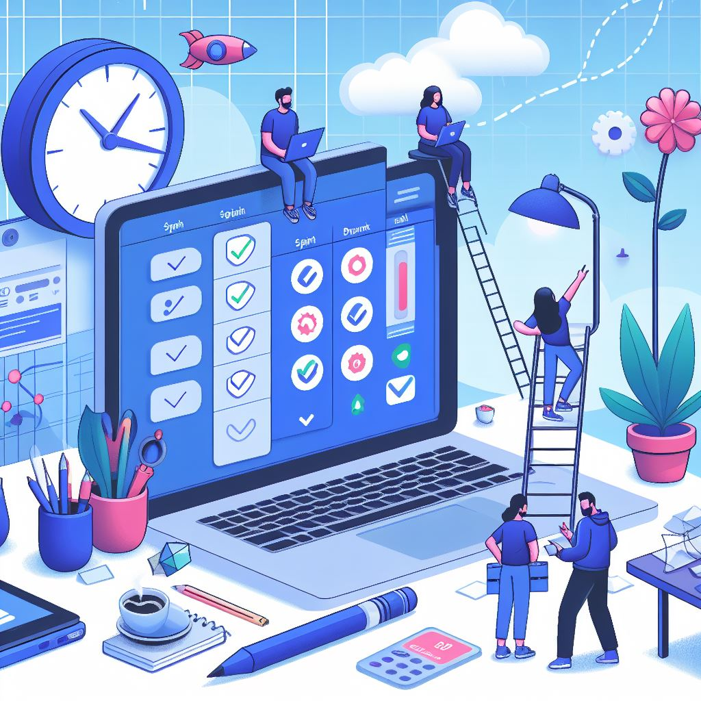
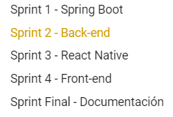
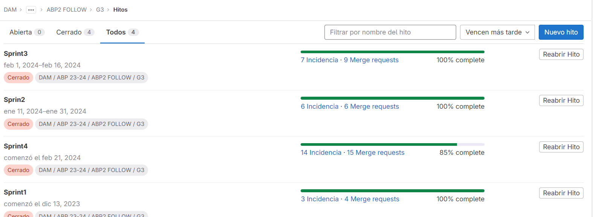
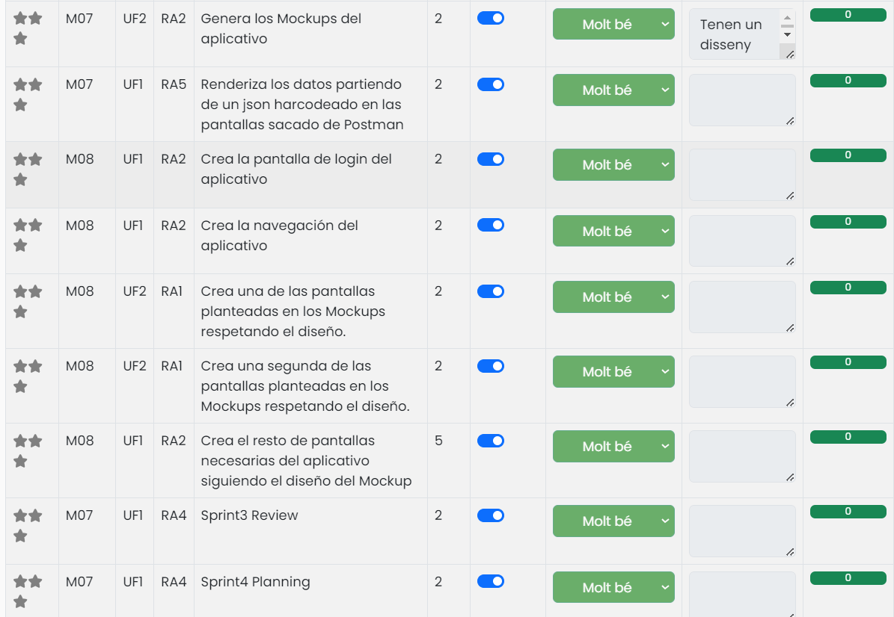

## Organización del proyecto 

### Gitlab y manejo de issues 

En este proyecto, se ha implementado un sistema rotativo de administración semanal. Esto nos ha permitido a todos obtener una visión práctica de cómo se maneja Git. Cada administrador (Sergio o Maria) ha sido responsable de gestionar aspectos clave como la creación de ramas, la fusión de cambios y la resolución de conflictos que pueden surgir durante la integración de las ramas en la rama principal.

A lo largo del desarrollo del proyecto, hemos realizado un total de 117 commits y hemos trabajado con 17 ramas diferentes. Ha sido un enfoque colaborativo y rotativo, nos ha permitido aprender y mejorar en cuanto a colaboración como equipo.

### Milestones y reparto de tareas

Para la realización de este proyecto, hemos establecido 4 milestones, cada uno correspondiente a un sprint específico. Cada milestone representa una etapa importante en el desarrollo del proyecto y nos ayuda a mantenernos enfocados y organizados.

El **primer milestone**, estableció la base de nuestra aplicación. Durante este sprint, cada miembro del equipo trabajó en una rama separada, lo que resultó en la creación de 3 ramas.

El objetivo principal de este primer sprint fue dar los primeros pasos en la creación de nuestra aplicación y definir su estructura y funcionalidad básica.

El **segundo milestone** estuvo dedicado a la implementación del back-end de nuestra aplicación. Durante este sprint, nos enfocamos en establecer la estructura básica del back-end, aunque tuvimos que adaptarla a lo largo del proyecto para satisfacer las necesidades cambiantes.

El **tercer milestone** marcó nuestro primer contacto con React Native, el framework que elegimos para el desarrollo del front-end. Durante este sprint, nos dedicamos principalmente a diseñar las páginas esenciales de la aplicación.

Finalmente, el **cuarto milestone** estuvo dedicado a los toques finales y a la corrección de funcionalidades de nuestro proyecto. Este sprint nos permitió pulir nuestra aplicación y asegurarnos de que todo funcionara como se esperaba.

Estamos orgullosos del trabajo que hemos realizado, pese a que la aplicación no esté perfecta.
### Sprint Reviews y Sprint Plannings

Cada semana, realizábamos una reunión de **Sprint Planning**. Durante estas reuniones, discutíamos las tareas que debían realizarse en el próximo sprint y dividíamos el trabajo entre los miembros del equipo. Esto nos permitía tener una visión clara de lo que cada uno de nosotros debía hacer.

Además, teníamos un tiempo establecido para realizar las **Sprint Reviews**. Estas reuniones se llevaban a cabo cada semana, o como máximo cada semana y media. Durante las Sprint Reviews, se revisaba y evaluaba lo que habíamos realizado durante el sprint.

Nuestro objetivo siempre ha sido llegar a los objetivos marcados, y hemos intentado hacer todo lo posible para lograrlo. 